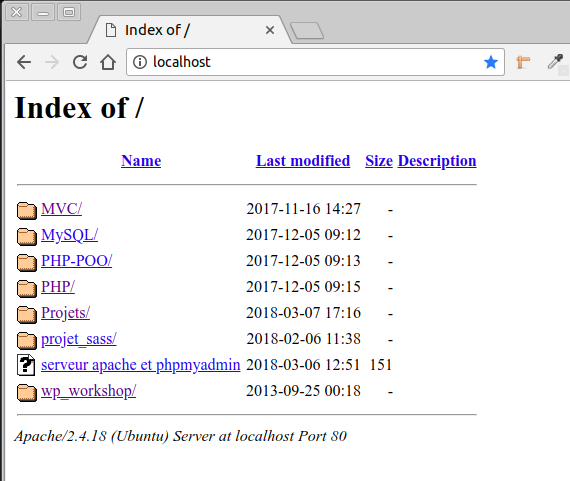

# WorkShop WordPress

**Date:** 23/03/2018 de 09h00 à 12h30

**Lieu:** BeCode - BeCentral - Local Lovelace

**Animatrice:** Marie-Ange Bouchat

---------------------------------------------------------------------------------------

## Partie 1 : Installation de WordPress

### Pré-requis

Dans le cadre de ce WorKshop nous développeront un site WordPress en local (sur votre ordinateur) afin d'en tester les différentes fonctionnalités.

Pour déployer votre site WordPress sur un serveur en ligne, vous pouvez vous référer a la partie "Annexes" de ce document qui vous explique la marche à suivre.

Pour installer WordPress vous avez besoin de :
- Le fichier zip télécharger sur le site wordpress.org reprenant tous les fichiers et dossiers composant la dernière version de WordPress
- Un serveur web ou logiciel permettant de créer un serveur web et DB sur votre ordinateur (mamp, xampp, lamp)
- Une base de données vide au départ (MySQL)
- Un logiciel FTP qui permet de transférer les fichiers de votre ordinateur vers votre serveur en ligne (uniquement si vous désirer mettre votre site en ligne immédiatement, pas nécessaire pour découvrir les fonctionnalités de WordPress et développer en local sur votre machine)

### Création de la DB avec phpMyAdmin

Lancer votre serveur Apache (Lamp, Xampp, Wamp)
Pour lamp taper dans la console : sudo /opt/lampp/lampp start
Dans le navigateur aller à l'adresse : http://localhost/phpmyadmin/
Passer la langue en Français
Utilisateur: root
Mot de passe: vide, root, user, autres ....

Veuillez à bien connaitre votre nom d'utilisateur et mot de passe pour PhpMyAdmin pour pouvoir créer une base de données et vous connecter à celle-ci.


Une fois dans phpMyAdmin, aller sur l'onglet "Bases de données", indiqué le nom de votre base de données. Pour l'exercice, nous l'appellerons "wp_workshop" puis cliquer sur le bouton "créer".
Une nouvelle base de données apparait dans la liste de gauche.
Lors de l'installation de WordPress, toutes les tables nécessaires au fonctionnement de WordPress viendront se placer dans cette base de données que nous avons préalablement crée.


### Téléchargement WordPress et installation en local


Site: https://fr.wordpress.org/ (version de l'interface en français ou anglais)
Site: https://wordpress.org/ (site avec interface en anglais - attention format date)


Attention : Ne confondez pas wordpress.org avec les sites https://fr.wordpress.com ou https://wordpress.com qui proposent une formule d'hébergement intégrée et gratuite de votre site WordPress mais dont les fonctionnalités, la possibilité de personnalisation, l'espace des stockage sont nettement plus limitée que celles de la version complète de WordPress. Nous allons donc nous intéresser à WordPress.org car qui peut le plus peut le moins. Libre à vous ensuite de choisir une formule plutôt que l'autre selon vos besoins en étant bien informé.

Pour en savoir plus sur la différence entre WordPress.org et WordPress.com :
* https://wpformation.com/wordpress-com-vs-wordpress-org-quelle-difference/
* https://wpmarmite.com/wordpress-com-ou-wordpress-org/


Dans la barre de menu, cliquer sur le bouton "Download WordPress", puis sur la nouvelle page qui s'ouvre cliquer sur "Download WordPress 4.9.4" (ou la dernière version disponible). Un fichier zip est télécharger sur votre ordinateur. Il contient tous le CMS WordPress de base.


Décompresser ce fichier zip et placer le dossier wordpress dans le répertoire utiliser par votre serveur local (www, html, ... ).


Nous allons à présent renommé ce dossier wordpress et nous allons l'appeller "wp_workshop".


A ce stade, nous avons donc un dossier wp_workshop (contenant tous les dossiers et fichiers de WordPress) dans le repertoire de notre serveur local et un base de donnée appellée wp_workshop vide crée dans phpmyAdmin. Nous pouvons passé à l'installation de WordPress.

Aller à l'adresse localhost (localhost:8888 pour Mac utilisant Mamp) sur votre navigateur et cliquer sur le votre dossier wp_workshop. L'installation de wordpress se lance.





Dans l'écran suivant on vous demande d'indiquer différentes informations, remplisser le nom de votre DB soit wp_workshop, votre nom d'utilisateur et votre mot de passe sur phpmyadmin, laisser localhost dans le champ suivant et afin d'améliorer la sécurité nous allons changer le préfixe qui sera ajouté à toutes les tables wordpress dans la DB par work_ à la place du wp_ par défault.


A ce stade il peut arriver qu'une erreur survienne, pas de panique. Cela signifie juste que WordPress n'arrive pas à créer automatiquement le fichier wp-config.php. POur le créer manuellement, il vous suffit de copier le code se trouvant dans la fenêtre (Ctrl+A puis Ctrl+C), de créer un nouveau fichier appelé wp-config.php à la racine du repertoire wp_workshop, d'y coller le contenu du code et de l'enregister.


Puis de cliquer sur le bouton "Lancer l'installation"


Dans la fenêtre suivante on vous demande de renseigner les information concernant votre site et le nom d'utilisateur et le mot de passe que vous utiliserait pour vous connecter à sa partie backend. Pour le titre de site indiqué par exemple: WordPress Workshop - Username : admin (pour l'exercice laisser admin mais pour un site réel, je vous conseille de le changer, ce sera encore possible par après). WordPress génère un mot de passe sécurisé par défaut contenant des majuscules, minuscules et caractères spéciaux, vous pouvez garder celui qui a été générer aléatoirement pour votre site ou utiliser un site du type https://www.motdepasse.xyz/ pour en générer un sur mesure. Veillez à ce qu'il affiche un niveau de sécurité Strong.

Attention: A cette étape, faites bien en copier-coller de votre mot de passe dans un fichier ou noter le sur un morceau de papier car sinon vous ne pourrez pas vous connecter à votre site.

Indiquer votre adresse mail et ne cocher pas la mention "Discourage search engines from indexing this site", car nous voulons que les moteurs de recherche indexe notre site. Cliquer sur le bouton "Install WordPress".


Success ! Voilà votre site WordPress est installé en local sur votre ordinateur. Cliquez sur le bouton "Se connecter" pour vous connecter au backend de votre site.


Remarque: A ce stade, si on se rend dans phpmyAdmin on peut constater que toutes les tables de WordPress (précédée du suffixe personnalisé work_ que nous avions indiqué )ont bien été placées lors de l'installation de WordPress dans la base de données vide que nous avions créée.


Vous arriver sur la page de login de votre site. C'est à cet endroit que vous vous connecter avec le backend avec le nom d'utilisateur (admin) et le mot de passe que vous avez noter à l'étape de Bienvenue de WordPress (et que vous avez noté et conservé précieusement).

Vous pouvez voir que l'url de votre site actuellement sur votre ordinateur en local est http://localhost/wp_workshop/wp-login.php, c'est cette adresse que vous devrez taper pour vous connecter à votre site en local dorénavant. (L'adresse est différente lorsque votre site est installé sur un serveur en ligne et non en local, elle dépendra du nom de domaine que vous avez choisi ex: http://www.monsupersite.be/)et pour accéder au login du backend http://www.monsupersite.be/wp-admin, mais nous verrons tout à l'heure qu'il est préférable de changer ce wp-admin commun à tous les sites wordpress par soucis de sécurité.

Nous allons à présent pouvoir passer à la seconde partie de ce workshop l'exploration des bases de WordPress.

----------------------------------------------------------------------------------------------


## Partie 2 : Introduction à WordPress


### Qu'est-ce qu'un CMS

CMS est l'abréviation de Content Management System (Système de gestion de contenu).

Concrètement, un CMS est un programme qui vous permet de créer facilement un site web car il intègre déja à la base tout ce dont vous avez besoin pour créer votre site sans avoir à coder vous-même vos pages. Vous pouvez vous concentrer uniquement sur la gestion de votre site. De plus la majorité des CMS sont gratuits et opensource.

Les CMS possède une interface d'administration visuelle (dashboard), simple et facile d'utilisation qui permet de créer un site rapidement en gérant facilement son apparence et l'affichage des différents éléments qui le composent  grâce à des mises en page prédéfinies appelés thèmes ou templates. Vous pourrez choisir un thème parmis les milliers de ceux-ci (gratuit ou payants) proposés sur internet (voir section Annexes) .Les CMS permettent également de gérer ses contenus , la mise en forme du texte, l'insertion d'images.... Vous obtiendrai ainsi rapidement un site à l'allure professionnelle et attractive.

Pour s'adapter à tous les besoins, les CMS peuvent s'enrichir de multiples extensions (plugins) qui ajoutent des fonctionnalités au CMS de base. Vous pourrez trouver des plugins sur le site de WordPress (https://fr.wordpress.org/plugins/).

Pour les développeurs et les personnes qui ont des connaissance en codage (HTML/CSS/PHP/MySQL), il permet en plus d'accèder au coeur même du CMS (core) pour aller encore plus loin dans la personnalisation et le développement de fonctionnalités sur mesure par la création de plugins, de thèmes et de widgets.

L'usage d'un CMS pour développer un site permet un gain de temps important, il permet également à plusieurs personnes de collaborer aisément à l'ajout de contenu sans connaissance de codage préalable et permet à l'administrateur du site de gérer des privilèges clairement defini pour chacun de ces collaborateurs et créateurs de contenu afin qu'il ne puissent accéder qu'à la partie du CMS dont ils ont besoins pour mettre à jour leurs contenus.

Les CMS sont des applications Web qui s'utilise dans les navigateurs web et sont donc indépendant de toute plateforme informatique (Mac, Windows ou Linux).

### Comment fonctionne un CMS

La majorité des CMS fonctionnent avec un système de 3 serveurs, chacun ayant un rôle déterminé:

* Serveur web: stocke les fichiers constitutifs du CMS et permet de gérer l'affichage HTML/CSS dans les navigateurs de voyageurs. Le plus utilisé est le serveur Apache.

* Serveur de base de données :  stocke tous les contenus rédactionnels et tous les réglages du site dans une base de données. Le plus utilisé est MySQL.

* Serveur d'application: son rôle est de construire les pages HTML/CSS qui sont demandées par les visiteurs en interrogeant la base de données. Le serveur le plus utilisé s'appelle PHP.

Concrètement les serveurs fonctionnent entre eux comme ceci:

1. Le visiteur demande à afficher le contenu d'un site web créé avec un CMS en tapant l'adresse du site dans le champ URL de son navigateur. Sa demande est réceptionnée par le serveur Web (Apache)

2. Le serveur web (Apache) envoie la demande au serveur d'application PHP, car le serveur web ne sait pas gérer les pages provenant des CMS.

3.Le serveur d'application PHP interrroge la base de données MySQL pour récupérer le contenu à afficher au visiteur.

4. La base de données MySQL envoie le bon contenu au serveur d'application PHP

5. Le serveur d'application PHP construit la page à afficher en HTML/CSS et l'envoie au serveur web.

6. Le serveur web envoie la page demandé au navigateur du visiteur.


Nous venons de voir les serveurs indispensables pour que WordPress focntionnent chez les hébergeurs professionnels en ligne. C'est la raison pour laquelle nous avons dû installer un package serveur (Apache, MySQL, PHP) tel que XAMPP; Mamp ou Lamp sur notre machine pour pouvoir tester et développer notre site en local.

Exemple concret:

Vous construiser un site multipages pour un restaurateur.
Si vous le réaliser en HTML/CSS/javascript, à chaque nouvelle modification désirée (par exemple mise à jour du menu des plats du jour de la semaine), votre client sera contraint de faire appel à vous, car il ne dispose pas des connaissance nécessaire pour effectuer seul ces modifications. Grâce à l'usage d'un CMS vous allez pouvoir lui fournir un site avec un accès rédacteur limité à une interface graphique qui lui permettra de mettre à jour facilement lui-même chaque semaine sa carte des plats du jour.Selon les privilèges que vous donnerez à son compte, il pourra où non apporter des modifications à d'autres pages de son site.


### WordPress et les autres CMS

WordPress est le leader des CMS.
Sur la totalité des sites présent sur le web, 30% sont réalisé avec WordPress. Ce chiffre est en constante évolution.

En 2018, sur la totalité des sites réalisé avec des CMS, 48.8% sont réalisés avec WordPress, qui écrase ainsi ses concurrent Drupal 5% et Joomla 4%. (Source: http://trends.builtwith.com/cms)


Pour en savoir d'avantage sur les statistiques concernant WordPress:
https://3click-solutions.com/fr/7-chiffres-cles-tour-de-wordpress-leader-des-cms/


### Tour d'horizon des 3 principaux CMS (WordPress, Drupal, Joomla)

**WordPress :**

Le choix favoris des débutants pour sa facilité d'utilisation et de prise en main. Ce CMS est particulièrement bien adapté pour les sites web de petites et moyennes taille, les blogs, les magasins de commerce electronique. Il peut cependant avec l'ajout de certains plugins s'avérer extrêmement complet et convenir parfaitement au sites web de structures beaucoup plus vastes

**Joomla :**

Idéal pour les sites Web de commerce electronique ou de réseautage social. Ce CMS est cependant plus difficile à appréhender et nécessite des compétences techniques plus poussées.

**Drupal :**

Le CMS le plus difficile, mais aussi le plus puissant. Il nécessite une maitrise de l'Html, CSS et PHP.

Pour en savoir davantage sur le choix entre WordPress, Joomla et Drupal:
https://websitesetup.org/cms-comparison-wordpress-vs-joomla-drupal/

### Pourquoi choisir WordPress

* Ce CMS est simple d'utilisation et permet une prise en main rapide sans nécessité de connaissance du code pour une installation de base.Cependant il permet aussi une personnalisation très fine lorsque l'on a recours à l'usage du code. Il convient donc aussi bien à des débutants, qu'à des utilisateurs avancés qui connaissent les langages de développement.

* Ce CMS vous permet de créer presque tout type de site (site vitrine, simple portail, magazine, blog, site de photo, annuaire, site d'annonce, site comunautaire, forum , réseaux sociaux, boutique en ligne, ....)

* WordPress est gratuit est open source (vous pouvez donc non seulement l'utiliser gratuitement mais également avoir accès à son code source afin de pouvoir le modifier ou de créer vos propres thèmes et plugins)

* Wordpress bénéficie d'un grande communauté et vous pouvez trouvez de l'aide et de la documentation dans pratiquement toutes les langues. Cette communauté est très active et participe à l'évolution constante de WordPress. Grâce à cette communauté vous pouvez être quasiment certains que les fonctionnalités que vous cherchez à developper sur votre site, on déja dû être développée auparavant et qu'une solution existe pour vous facilité la vie comme par exemple un plugin ou un tutoriel.

* WordPress suit de près l'évolution d'internet et des normes HTML et CSS. La majorité des thèmes proposés inclus l'aspect responsive afin de pouvoir s'adapter à toutes les tailles d'écrant (smartphone,tablette, PC portable ou grands écrans)

* WordPress est bien optimisé pour le référencement Web. Certaines extensions ou thèmes vous permettront d'acroitre encore cette optimisation SEO mais d'autres sont moins bien pensées à ce sujet. Il existe des extensions dédiées (plugins) spécifiquement développer pour améliorer votre référencement.

### Quelques points sur lesquels portés votre attention lorsque vous utiliser WordPress

* La multitudes des plugins et des thèmes proposés peut vite vous faire tourner la tête et vous inciter à installer tous ce qui vous tombe sous la main. Former vous un minimum à WordPress avant de vous lancer tête baissée dans l'installation à tout va de plugins qui pourraient de par leurs accumulation provoqués des lenteurs et des erreurs. De nombreux sites vous conseille sur les plugins de bases incontournables. Déterminer les fonctionnalités que devra avoir votre site, voyez ce que vous fournit déja le core de WordPress et ajouter un plugin uniquement si son usage se justifie.
En voici déja 10 gratuits que je vous recommande d'utiliser selon vos besoins: https://blogdummi.fr/dossier/10-plugins-incontournables-wordpress/
N'hésitez pas à consulter internet pour vous tenir au courant des nouveaux plugins. Le nombres de téléchargement d'un plugins sur le site de wordpress.org est aussi généralement un bon indicateur de sa popularité. (https://wordpress.org/plugins/)

* Attention, lors de mises à jour il est possible que les thèmes et les plugins ne soient plus compatibles et provoquent des bugs. Dans ce cas référer vous au support du thème (uniquement lorsque thème payant) ainsi qu'au forum de support du plugin (on y accède en cliquant sur le bouton "View support forum" dans la page dédiée du thème sur wordpress.org - exemple: https://wordpress.org/plugins/akismet/). Vérifier également avant d'installer un plugin qu'il est mis régulièrement à jour par son développeur pour éviter ce type de problème (voir last updated sur la page dédié du plugion sur wordpress.org)

* WordPress victime de sa popularité

Etant donné le nombre de sites conçu avec WordPress, une nouvelles failles de sécurité trouvée par des pirates peut être rapidement exploités sur un grand nombres de sites. Pour évite cela, garder votre WordPress et vos plugins à jour et installer des extensions (plugins) de sécurité contre les spams, mauvaises requêtes, injections ... (exemple : https://wordpress.org/plugins/secupress/ -  )

### Présentation de sites réalisés avec WordPress

**Sites de Société de renommée internationale réalisés avec WordPress**
(Automobile, electronique, Telecommunication, Presse, Media, hotellerie, banque, fournisseur d'energie, ...)

* Mercedes-benz (https://www.mercedes-benz.com/en/)
* Vivendi (http://www.vivendi.com/)
* BNP Paribas (http://bnpparibas.be/fr/)
* GDF (https://particuliers.engie.fr/)
* Dassault (https://www.dassault-aviation.com/fr/)
* Bouygues (https://www.bouyguestelecom.fr/)
* Forbes (https://www.forbes.com)
* CNN (https://edition.cnn.com/)
* Sony (https://www.sony.be/fr)
* The New Yorker (https://www.newyorker.com/)
* Le Royal Monceau (https://www.leroyalmonceau.com/)
* BBC America (http://www.bbcamerica.com/)

**Organisation humanitaire**

* Obama foundation (https://www.obama.org/)

**Célébrités**

* Leonardo Dicaprio (http://leonardodicaprio.com/)
* Beyonce (https://www.beyonce.com/)
* Sylvester Stallone (https://sylvesterstallone.com/)
* Katy Perry (https://www.katyperry.com/)
* Snoop Dogg (http://snoopdogg.com/)
* Rollingstones (http://www.rollingstones.com/)

Et bien d'autres, voir: https://www.elegantthemes.com/blog/tips-tricks/11-examples-of-actor-websites-built-with-wordpress

**Blog:**

* Star Wars Blog officiel (http://www.starwars.com/news)

**E-commerce:**

* Picky Bars (WP + WoocCommerce) (https://pickybars.com/)
* Blue Star coffee Roasters (https://bluestarcoffeeroasters.com/)

**Portefolio:**

* Tinkering Monkey (http://www.tinkeringmonkey.com/work/)
* Brian Smith Pictures (http://briansmith.com/)

**Achat de ticket en ligne:**

* Carolina Roller Girls (http://www.carolinarollergirls.com/)

**Site corporate:**

* Google Ventures (http://www.gv.com/)

**Education**

* Collège Saint-Michel - Bruxelles (http://college-st-michel.info/wp/)
* Canada Learning Code (https://www.canadalearningcode.ca/)

Pour avoir un aperçu d'autres sites réalisés avec WordPress à travers le monde : https://wordpress.org/showcase/archives/


### L'interface de WP - Les différentes parties de la console d'administration de WordPress (Tableau de bord)

Comment accèder à l'interface de wordpress (console d'administration ou Dashboard). Entrez l'adresse de votre site dans votre navigateur suivie de /wp-admin (exemple:votre-nom-de-domaine.com/wp-admin). Si vous travailler en local et que votre site n'est pas encore en ligne (exemple:http://localhost/nom_de_votre_site/wp-admin/). Dans notre cas nous allons donc taper l'url:http://localhost/wp_workshop/wp-admin/ pour accèder à l'interface d'administration.


Voici l'interface d'administration de votre site WordPress. C'est à partir d'ici que vous aller pouvoir personnalisé votre site, y ajouter des pages, des articles et paramètrer les options, installer de nouveaux plugins, ...


L'interface d'administration de WordPress est composée de 3 zones principales:

1. La barre des outils dans la partie supérieure
2. La barre des menus sur la gauche
3. La partie centrale de gestion de l'administration

#### La barre d'Outils

La barre d'outils présente différentes parties :

1. Le menu WordPress


**A propos de WordPress**

Affiche un écran reprenant toutes les nouveautés de la version de WordPress installée. (Nouveautés)- Les personnes ayant contribués à la création de cette version de WordPress (Crédits) - Des informations concernant la nature open-source et licence GPL de WordPress (Liberté) - Une indications vous informant de l'envoi de données à WordPress.org concernant la version et les plugins utilisé sur votre site à visée essentiellement statistique (Vie privée)

**Site de WordPress-FR**

Lien vers le site : https://wpfr.net/ qui reprend un grand nombre d'information sur la communauté WordPress francophone. Vous pourrez trouvez ici des informations très intéressantes si vous désirez apprendre WordPress ou obtenir une aide ou un support vi a différents Forums dédiés (WordPress, WooCommerce, thèmes, extensions, multisite, ...). Vous pourrez également y trouver de nombreuses actualités sur WordPress et sur les évènements à venir (ex: WordCamp). Vous pourrez également adhérez à l'association WPFR où vous serez invité à prendre part à de nombreux projets et pourrez bénéficiez d'offres spéciales auprès des partenaires de l'association.Vous pouvez aussi vous abonnez à la newsletter.

**Documentation**

Accès au Codex de WordPress (en anglais : https://codex.wordpress.org/) .Ici est rassembler toute la documentation de WordPress. Une version française est également disponible ici (https://codex.wordpress.org/fr:Accueil). Cette version est partiellement traduite. Vous pouvez contribuer à sa traduction (https://codex.wordpress.org/Codex:Contributing)

**Forums d'entraide**

Vous redirige vers les forums d'entraide du site de la communauté francophone de Wordpress (https://wpfr.net/support/)

**Remarque**

Ce lien renvoie vers la section "Support" du site americain https://wordpress.org/

2. Le menu du site


Le lien reprend le nom du site défini à l'installation. L'unique élément de ce menu s'appelle toujours "Aller sur le site". Il vous permet d'afficher votre site tel qu'il sera vu par vos visiteur (basculer de l'administration vers la partie visible du site).
Petite astuce. Cliquer sur le lien "Aller sur le site" en appuyant en même temps sur la touche Ctrl de votre clavier. Cela permet d'ouvrir le visuel de votres site dans un nouvel onglet et de garder le tableau de bord ouvert dans un autre onglet. C'est plus pratique pour voir les modifications.

3. Menu mises à jour


Cette partie est importante. Elle vous indique si des mises à jour sont disponibles pour WordPress mais également pour les extensions que vous avez installées sur votre site (plugins et thèmes).

Lorsque vous cliquer sur l'icone, celle ci affiche dans la zone principale de l'interface d'administration les mises à jour disponibles et vous permet de choisir ou non de les installés. Je vous conseille vivement d'installer toutes les mises à jour car celles-ci contribuent énormément à la sécurité de votre site en corrigeant par exemple des failles de sécurité ou des bugs.


Les mises à jour disponibles s'affiche également sous la forme d'un rond orange avec le nombre de mises à jours disponible dans la barre latérale. En cliquant sur "Mises à jour" la partie principale de l'interface affiche la même page que lorsque vous cliquer sur l'icone de mise à jour dans la barre d'outils en haut. Par contre lorsque vous cliquer sur Extensions dans la barre latérale qui mentionne qu'une mise à jour est disponible pour une ou plusieur extensions, cela affiche dans la zone principale la liste de toutes les extensions utlisée et vous indique qu'une nouvelle version est disponible avec une petite zone de notification orange. Vous pouvez également effectuer la mise à jour à cet endroit en cliquant sur "Mettre à jour maintenant"


**Remarque concernant les mises à jour:**

Certaines mises à jour mettent un certains temps pour s'effectuer. Il faut savoir que durant cette période, votre site apparaitra comme indisponible pour la consultation par vos utilisateurs. Je vous conseille donc dans la mesure du possible d'effectuer ces mises à jour à une période de faibles affluences sur votre site (par exemple tôt le matin ou tard le soir)

4. Menu des commentaires


Le menu des commentaires indique si des commentaires sont en attente de modération. Au départ WordPress a été conçu comme un CMS orienté blog (ce qui explique le système de page, article et commentaires). Un commentaire en attente de modération est un commentaire qui est en attente de savoir ce qu'on va faire de lui. (désapprouver, répondre, modifier, placer dans la zone indésirable ou placer dans la corbeille). Nous verrons cela plus en détails plus tard.

5. Le menu des nouveaux contenus (+ Créer)


Ce menu permet d'accéder rapidement à la création de nouveaux contenus (Article, Fichier media, Page, Utilistateur). Nous verrons plus en détails l'ajout de chacun de ces contenus lors de la présentation de la barre latérale qui reprend un liens "Pages", "Articles", "Médias" et "Utilisateurs". Il s'agit juste ici d'une sorte de raccourci qui mène exactement au même endroit dans l'interface d'administration que lorsque vous cliquer sur les liens de la barre latérale.

6. Le menu de connexion (tout à fait à droite)


WordPress vous salue avec votre identifiant de connexion (admin). Cette partie de la barre d'outils permettent de modifier votre profil

**admin et Modifier mon profil**

Ces deux liens affiche votre Profil dans la partie principale de l'interface et vous permettent de modifier différentes options.


Vous pouvez dans cette sections laissé la majorité des réglages par défault, cependant certains d'entre eux doivent être modifiés. Vous pourrez également remplir par après les informations personnelles comme un lien vers votre site web personnel (portefolio ou site d'entreprise), renseignements biographiques, illustration du profil, Nom, Prénom, etc...

Il est conseiller de changer l'identifiant qui jusqu'à présent était admin. Pour réaliser cela malgèrs la notification indiquant que les identifiants ne peuvent pas être modifiés, je vous renvoie à ce tutoriel (https://korben.info/securiser-wordpress-changer-nom-compte-admin.html)
Attention en changeant votre identifiant, il faut savoir que c'est à présent ce nouvel identifiant que vous devrez utiliser pour vous connecter à l'interface de WordPress donc noter-le dans un endroit sécurisé avec votre mot de passe de connexion.

Il est également conseillé d'indiqué un pseudonoyme. Celui-ci sera utilisé pour signé les articles que vous aller rédiger et pourra donc être visible par les utlisateurs de votre site si vous décider d'afficher l'auteur des articles. Un fois un pseudonyme choisi, vous verrez que celui-ci viendra s'ajouter dans la liste déroulante des Nom à afficher publiquement. Selectionner maintenant votre pseudo au lieu d'admin pour ne pas faciliter la tâche à d'éventuel pirate qui si vous n'avez pas indiquer de pseudo, auront déja dès le départ le nom de votre login, il ne leur restera plus qu'à tenter de trouver votre mot de passe. Un pseudo, nom affiché publiquement différent de votre identifiant est un barrage de sécurité en plus.  


C'est également à cet endroit que vous pourrez "générer un nouveau mot de passe" si vous pensez que votre mot de passe à été compromis et vous "déconnecter partout ailleurs"  ou si vous avez oubliez de vous déconnecter d'un ordinateur public.

N'oubliez pas de cliquer sur le bouton "Mettre à jour le profil" pour que les modifications soient prises en compte.

**Se déconnecter**

Le lien "Se déconnecter" vous permet comme son nom l'indique de vous déconnecter  de l'interface d'administration de WordPress. Un fois que vous avez terminer de travailler dans votre site, n'oubliez pas de quitter l'administration en utilisant "Se déconnecter". Eviter de fermer la fenêtre ou l'onglet par la cas de fermeture ou de quitter votre navigateur directement, car la connexion ne serait alors pas effectuer correctement et permettrait une reconnexion sans indiquer le login et mot de passe. Cela peut vous sembler pratique mais cela signifie aussi que toute personne qui utiliserait votre ordinateur ou en cas de vol, aurait accès à l'administration de votre site.

#### La barre des menus (barre latérale gauche)

La barre des menus permet de gérer la totalité de votre site web.

Cette barre de menus est divisée en 3 parties:

* Tableau de bord (tableau de bord)
* Gestion des contenus (Articles, Médias, Pages, Commentaires)
* Gestion du site (Apparence, Extensions, Utilisateurs, Outils, Réglages)

Pour gagner de la place sur les petits écran vous pouvez réduire cette barre de menus à une simple barre d'icones en cliquant sur "Réduire le menu". Cette réduction se fait automatiquement si vous réduisez la taille de la fenêtre (responsive). Pour retrouver la barre de menu sous sa forme traditionnelle cliquer sur l'icone avec la flèche toute en bas de la barre de menu.

Les différentes parties du menu s'ouvrent au simple survol de celles-ci pour révéler les sous-menus. Cliquer sur le menu pour laisser afficher le sous-menu.

Vous ne pouvez disposez que d'un menu ouvert à la fois. Lorsque vous cliquer sur un élément du sous-menu celui-ci apparait en blanc et la totalité du sous-menu se place sous l'élément de menu dans la barre latérale.


Chaque élément de menu permet d'accéder à des fonctionnalités qui lui sont propres. Ces fonctionnalités peuvent être présentées sous la forme de zones encadrée appellées modules. Chaque module peut être masqué ou affiché en cliquant sur la petite flèche qui se trouve dans son coin supérieur droit. Vous pouvez égalemnent les déplacer si vous souhaitez réorganiser à votre façon par exemple la page Acccueil du Tableau de bord. Il vous suffit de cliquer/ glisser/déposer le module à l'endroit où vous souhaiter les déplacer. Eviter de le faire dans l'immédiat afin d'avoir un interface identique à celle utilisée pour les exemples pour mieux vous y retrouver. Vous aurez tout le temps de personnalisé par après.

Exemple: module Format de l'élément Ajouter du menu articles


Pratiquement tous les écrans de l'administration peuvent être personnalisés. Vous pouvez décider d'afficher ou non tle ou tel module et paramètrer les affichages de certains tableaux de données. Ce paramètrage se fait avec le bouton "Options de l'écran" situé juste sous la barre des outils (en haut à droite)


Selon que vous soyez sur le tableau de bord, les articles, les pages ... vous aurez des options différentes présentes dans les options d'écran.


1. Tableau de bord

**Accueil**

Vous ramène à la page d'accueil de l'interface d'administration de WordPress

**Mise à jour**

Vous ramène à la page des mises à jour disponible pour votre version de Wordpress ainsi que pour les extensions que vous avez installées comme lorsque vous cliquer sur l'icone mises à jour dans la barre d'outils (en haut)

WordPress nous indique qu'une mise à jour est disponiblepour l'extension Akismet Anti-Spam (qui est un plugin très pratique installé par défaut avec WordPress). Je vous conseille de le garder pour protéger votre site du spam. Il faudra cependant penser à activer cette extension. Nous verrons comment faire lorsque nous verrons la partie extensions de la barre de menus.


Selectionner les Extensions que vous désirez mettre à jour et cliquer sur le bouton "Mettre à jour les extensions"

Pour certain utilisateur de linux sous Ubuntu, WordPress demande de passer par FTP pour pouvoir faire les mises à jours. Ce n'est pas normal, mais il y a une solution ! Il s'agit d'un problème de droit d'écriture pour l'utilisateur sur le dossier WordPress.


##### Etape à suivre uniquement pour les utilisateurs qui rencontre le problème FTP lors de la mise à jour des extensions WordPress

* Récupérer le fichier test.php dans le repo github dédié au workshop (dossier installation/Etape 3 - Solution demande FTP install en local sous Ubuntu/test.php)

* Placer ce fichier test.php à la racine du dossier courant de votre serveur Apache (html ou htdocs selon les cas)

* Ouvrez un nouvel onglet dans votre navigateur à l'adresse localhost et cliquer sur test.php pour l'exécuter.

* Un mot apparait à l'écran (il peut s'agir de daemon ou de www-data ou autre), copier ce mot (Ctrl+C)

* Ensuite aller vous positionner sur le dossier htdocs ou html de votre serveur Apache dans votre explorateur de fichiers

* Faite un click droit sur le dossier et dans le menu déroulant selectionner Open in Terminal"

* Vous devriez avoir dans votre console un chemin ressemblant à cela :

```
user@nb25:/var/www/html$
```

ou

````
user@nb25:/opt/lampp/htdocs$
````
* Taper maintenant la commande suivante dans votre console (attention remplacer www-data par le mot obtenu avec le fichier test.php et remplacer wp_workshop par le nom du dossier wordpress sur lequel vous travailler)

````
sudo chown -R www-data: wp_workshop
````

Attention : Cette opération devra être répétée à chaque fois que vous créer un nouveau dossier wordpress pour éviter ce problème de demande de FTP lorsque vous développer en local et que vous tenter de faire des mises à jour d'extensions.

Retourner sur l'onglet où se trouve l'interface d'administration de votre WordPress.Important: RAFRAICHISSEZ LA PAGE. Aller dans "Extensions" et cliquer sur mise à jour pour les extensions qui le demande. En principe la mise à jour se déroule maintenant sans problèmes.

Voici la procédure détaillée dans un tuto : https://medrhamnia.wordpress.com/2011/06/18/pourquoi-wordpress-demande-les-parametres-de-connexion-ftp-en-local/


2. Articles

**Tous les articles**

**Ajouter**

**Categories**

**Etiquettes**

3. Médias

**Bibliothèque**

**Ajouter**


4. Pages

**Toutes les pages**

**Ajouter**

5. Commentaires


6. Apparence

**Thèmes**

**Personnaliser**

**Widgets**

**Menus**

**En-tête**

**Editeur**


7. Extensions

**Extensions installées**

**Ajouter**

**Editeur**


8. Utilisateurs

**Tous les utilisateurs**

**Ajouter**

**Votre profil**


9. Outils

**Outils disponibles**

**Importer**

**Exporter**


10. Réglages

**Général**

**Ecriture**

**Lecture**

**Discussion**

**Médias**

**Permaliens**


### Installation et usage des thèmes


### Plugins et widgets


### Connaitre le theme et les plugins utilisés sur un site WordPress**

Rendez-vous à l'adresse : http://whatwpthemeisthat.com/
Taper l'url du site concerné dans le champ de recherche et voilà !!!!
Pour tester, taper l'adresse: http://www.tinkeringmonkey.com/work/

### Outils de commerce en ligne


### Traduction de vos sites multilingues


### Bonnes pratiques dans l'usage de WordPress

* Effacer les fichiers et articles inutiles sans WordPress après installation - supprimer certains réglages par default (settings/permalinks; supprimer fichier readme.html (à la racine), suppprimer tagline settings/general et remplacer par theme du site pour le SEO, modifier footer (fièrement propulsé par Wordpress + hook avec mise à jour automatique de l'année))

* Mettre à jour régulièrement son site tant la version de WordPress que les plugins (sécurité)

* Faire des sauvegarde régulières de son site sur son ordinateur + support distant (usage plugin udpdraft Plugins)

* Eviter l'abus de plugins pour ne pas limiter les performances de votre site et limiter le risque d'erreurs

* Penser à l'optimisation SEO à chaque étape de la conception de votre site (du choix du nom de domaine à la rédaction de contenu, jusqu'au nommage des images)

* Veillez à effectuer une gestion des droits utilisateurs intelligentes qui à la fois permet aux rédacteurs et collaborateurs d'avoir accès à ce dont ils ont besoins tout en limitant l'accès aux autres parties du site (masquage de certaines zones de controles selon les utilisateurs)- activé akismet fournit par defaut (anti-spam)

* Mettez en place un plugins de sécurité pour contrer les failles les plus courantes liés au succès de ce CMS. (secu-press - julio potier)

* Ne donnez pas accès à trop d'option de customisation à vos utilisateurs rédacteurs sous peine de voir votre charte graphique devenir très vite chaotique (accès à la couleur, à des polices fantaisie, etc...)

* Veillez à toujours optimiser vos images et vos vidéos pour le web avant de les intégrés dans la bibliothèque de votre site. Le poids des images et autres éléments graphiques peut peser très lourd dans la balance en matière de performance et de rapidité de votre site.

* Ne plonger pas systèmatiquement sur les ressources gratuites en matière de thème ou de plugins car ce type d'offre ne vous apporte souvent pas un bon support client et limite vos possibilités de personnalisations. Investir un peu d'argent peut vous faire gagner un temps précieux et vous éviter beaucoup de soucis.

* Vérifier toujours la compatibilité des plugins avec la version de WordPress que vous utiliser et vérifier également si le développeur met toujours à jour régulièrement le plugin qui vous intéresse. En cliquant sur le plugin dans la page https://wordpress.org/plugins/, exemple : https://wordpress.org/plugins/akismet/, on peut constater dans la colonne de droite que la dernière mise à jour (Last update: 3 weeks ago) date d'il y a 3 semaines. De plus vu le nombre d'installation actives  (5+ millions) de ce plugin, il est fort à parier qu'en cas de bug, celui-ci sera très vite réparer et que vous pourrez également trouverer de l'aide auprès d'autres personnes utisant ce même plugin sur leur site.

* Changer votre pseudonyme et le nom afficher publiquement dans la section modifier mon profil de la barre d'outils en haut de l'interface d'administration WordPress. Vous pouvez également changer votre identifiant afin de compliquer la tâche des pirates informatique (voir procédure : https://korben.info/securiser-wordpress-changer-nom-compte-admin.html )

* Dans les extensions, supprimer Hello Dolly qui n'est là qu'à titre d'exemple.

* Activer l'extension Akismet Anti-Spam dans les extensions


---------------------------------------------------------------------------------------


## Partie 3 : Aller plus loin avec WordPress

### Création et personnalisation de thèmes

#### Création thème enfant
https://wpmarmite.com/creer-theme-enfant/

#### Création d'un nouveau thème

##### Création d'un nouveau thème vierge avec underscores.me

Utiliser le site http://underscores.me/ pour créer un dossier zip portant le nom de votre nouveau thème que vous avez entrer sur le site. Ce dossier zip contient tous les dossiers et fichiers de base d'un dossier thème vierge. Cela vous évite de devoir créer tous ces fichiers manuellement. Il ne vous reste plus qu'à décompresser l'archive zip générée par le site et placer le dossier décompressé dans la structure de votre site WordPress dans le dossier wp-content/themes.

### Création d'extensions

### Création de widgets

### Snippets pour personnalisé votre site avec quelques copier-coller de fragment de code
https://wpmarmite.com/snippets/

## Partie 4 : Maintenance et Optimisation

* Sécurisation
* Optimisation
* Sauvegarde
* SEO
Dans settings / permalinks choisir l'option post name pour l'affichage des url qui reprend le titre de l'article . C'est ce qui donne les meilleurs résultats pour le référencement.

Partie 5 : Conclusion

* Conclusion

## Partie 6 : Annexes

### Ressources

#### Comment déployer son site Wordpress sur un serveur en ligne

Pour installer WordPress en ligne vous avez besoin de :
- Un serveur web (voir liste de suggestions plus bas)
- Un nom de domaine (DNS) - exemple: http://www.supersite.be
- Une base de données (MySQL)
- Un logiciel FTP qui permet de transférer les fichiers de votre ordinateur vers votre serveur en ligne (par exemple FileZilla Client - gratuit) (https://filezilla-project.org/)


**Nom de domaine**

Un nom de domaine ou DNS est un nom unique que vous choisissez pour votre site afin de lui conférer une identité sur internet. Il s'agit de l'adresse url de votre site, c'est donc à grâce à elle que vos utilisateurs vont pouvoir vous trouver. Il est donc important qu'elle soit facile à retenir, ne prête pas à confusion dans sa manière d'être orthographiée, ne soit pas trop longue.

Un nom de domaine se compose de deux parties:

* le nom: par exemple "supersite"
tout est possible le nom peut se composer de deux ou plusieurs signes, il peut comporter des lettres de aà z, des chiffres de 0 à 9 ou d'un tiret.
* l'extension ou TLD (Top Level Domain) (la parite qui suit le point): ex: .be, .fr; .com, .eu etc...
Il existe de nombreuses extensions. Certaines sont liées au pays (.be, .fr., .ca, ...), d'autres aux type d'activités de votre site (.com, .biz, .net, .info, .org, ...)

Voici quelques articles qui vous apporterons de précieux conseils dans l'étape cruciale du choix de votre nom de do


**Hébergement**

Vous pouvez choisir un hébergeur qui respecte les 2 conditions suivantes : le serveur doit être capable de lire le langage PHP et le langage de base de données MySQL.

Les recommandation du site WordPress.org en matière d'hébergement sont les suivantes, elle ne représente pas une limitation mais bien une recommandation pour une meilleure securité:

Serveur Apache ou NGinx
PHP version 7.2 ou supérieure
MySQL version 5.6 or supérieur OU MariaDB version 10.0 ou supérieur
support du HTTPS

Configuration minimale de votre hébergeur pour un site WordPress:

PHP 5.4 ou supérieure
MySQL 5.5 ou supérieure

Attention ce type de configuration vous expose à des failles de sécurité connues et non colmatées dans ces versions et à un éffondrement des performances de votre site.

Voici quelques articles qui pourront vous aider dans le choix de votre hébergeur en fonction de vos besoins: (hébergement sur un serveur mutualisé, dédié VPS ou spécialement conçu pour WordPress)

https://wpmarmite.com/hebergement-wordpress/
https://www.mister-wp.com/guests/quel-hebergeur-web/
https://wpformation.com/choisir-hebergement-wordpress/

Par expérience, je vous déconseille les offres d'hébergement gratuites qui souvent offrent de piètres performances mais surtout qui en cas de problème vous offre un support quasi inexistant. Les offres payantes ne signifie pas de se ruiner, certaines offre débute à 2.41€/mois auquel il faudra ajouter le prix de votre nom de domaine (https://www.dnsbelgium.be/fr/nom-de-domaine) au alentour de 10€


Les hébergeurs que je vous conseille:

- OVH (https://www.ovh.com/fr/) - payant - leader du marché - prix bas mais peu être complexe et support mail lent mais rapide par téléphone

- One.com (https://www.one.com/fr/) - payant - prix très attractif,2.41€ TTC/mois) interface en français et très claire et accès directement via l'interface du site à votre DB - support en ligne 24h/24 - Website Builder 5 pages gratuits inclus dans l'offre. Nom de domaine pouvant également être commander sur le site (prix à partir de 8€, 9€ pour un .be)

- O2swithc (https://www.o2switch.fr/)

Je vous recommande de consulter cet article concernant les meilleurs hébergements de sites WordPress pour 2018 : https://hebergement-wp.info/comparatif-hebergements-wordpress/

Pour les sites de eCommerce qui se doivent d'être toujours accessible et sécurisé, le choix d'un hébergement de qualité est primordiale. Je vous recommande de consulter cet article concernant plus spécifiquement le top 5 des meilleurs hébergements WooCommerce pour 2017 : https://hebergement-wp.info/comparatif-hebergements-woocommerce/


Voici quelques articles qui pourront vous aider dans le choix de votre hébergeur en fonction de vos besoins:

https://wpformation.com/choisir-hebergement-wordpress/


Lorsque vous souscrivez à une formule d'hébergement, vous recevez un mail de votre hébergeur contenant les codes d'accès (adresse, identifiant, mot de passe, port) nécessaires pour mettre votre site en ligne sur votre espace d'hébergement.

Selon les hébergeurs, les instructions seront peut-être légèrement différentes, mais généralement, vous devrez placer le contenu de votre dossier wordpress (pas le dossier mais uniquement son contenu) dans le dossier nommé "www" ou directement à la racine de votre espace d'hébergement.

#### Les sites traitant de WordPress pour vous tenir au courant et en apprendre plus

* WP Marmite (https://wpmarmite.com) :  Un site en français très bien conçu pour les débutants, qui vous permettra de gagner rapidement en compétences et de répondre à la majorité des questions que vous pouvez vous poser lorsque vous débuter avec WordPress. On vous prends par la main et on vous explique tout ;)


#### Glossaire des termes wordPress

https://wpmarmite.com/glossaire/
