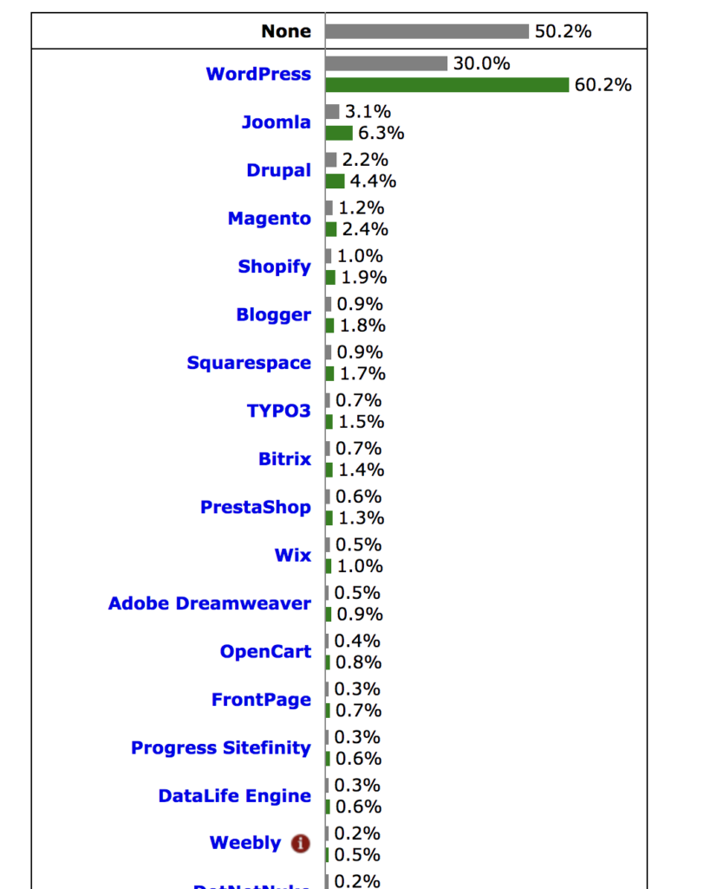

# Partie 2 : Introduction à WordPress

## Qu'est-ce qu'un CMS

CMS est l'abréviation de Content Management System (Système de gestion de contenu).

Concrètement, un CMS est un programme qui vous permet de créer facilement un site web car il intègre déja à la base tout ce dont vous avez besoin pour créer votre site sans avoir à coder vous-même vos pages. Vous pouvez vous concentrer uniquement sur la gestion de votre site. De plus la majorité des CMS sont gratuits et opensource.

Les CMS possède une interface d'administration visuelle (dashboard), simple et facile d'utilisation qui permet de créer un site rapidement en gérant facilement son apparence et l'affichage des différents éléments qui le composent  grâce à des mises en page prédéfinies appelés thèmes ou templates. Vous pourrez choisir un thème parmis les milliers de ceux-ci (gratuit ou payants) proposés sur internet (voir section Annexes) .Les CMS permettent également de gérer ses contenus , la mise en forme du texte, l'insertion d'images.... Vous obtiendrai ainsi rapidement un site à l'allure professionnelle et attractive.

Pour s'adapter à tous les besoins, les CMS peuvent s'enrichir de multiples extensions (plugins) qui ajoutent des fonctionnalités au CMS de base. Vous pourrez trouver des plugins sur le site de WordPress (https://fr.wordpress.org/plugins/).

Pour les développeurs et les personnes qui ont des connaissance en codage (HTML/CSS/PHP/MySQL), il permet en plus d'accèder au coeur même du CMS (core) pour aller encore plus loin dans la personnalisation et le développement de fonctionnalités sur mesure par la création de plugins, de thèmes et de widgets.

L'usage d'un CMS pour développer un site permet un gain de temps important, il permet également à plusieurs personnes de collaborer aisément à l'ajout de contenu sans connaissance de codage préalable et permet à l'administrateur du site de gérer des privilèges clairement defini pour chacun de ces collaborateurs et créateurs de contenu afin qu'il ne puissent accéder qu'à la partie du CMS dont ils ont besoins pour mettre à jour leurs contenus.

Les CMS sont des applications Web qui s'utilise dans les navigateurs web et sont donc indépendant de toute plateforme informatique (Mac, Windows ou Linux).

**Exemple concret:**

Vous construiser un site multipages pour un restaurateur.
Si vous le réaliser en HTML/CSS/javascript, à chaque nouvelle modification désirée (par exemple mise à jour du menu des plats du jour de la semaine), votre client sera contraint de faire appel à vous, car il ne dispose pas des connaissance nécessaire pour effectuer seul ces modifications. Grâce à l'usage d'un CMS vous allez pouvoir lui fournir un site avec un accès rédacteur limité à une interface graphique qui lui permettra de mettre à jour facilement lui-même chaque semaine sa carte des plats du jour.Selon les privilèges que vous donnerez à son compte, il pourra où non apporter des modifications à d'autres pages de son site.

## Comment fonctionne un CMS

La majorité des CMS fonctionnent avec un système de 3 serveurs, chacun ayant un rôle déterminé:

* Serveur web: stocke les fichiers constitutifs du CMS et permet de gérer l'affichage HTML/CSS dans les navigateurs de voyageurs. Le plus utilisé est le serveur Apache.

* Serveur de base de données :  stocke tous les contenus rédactionnels et tous les réglages du site dans une base de données. Le plus utilisé est MySQL.

* Serveur d'application: son rôle est de construire les pages HTML/CSS qui sont demandées par les visiteurs en interrogeant la base de données. Le serveur le plus utilisé s'appelle PHP.

Concrètement les serveurs fonctionnent entre eux comme ceci:

1. Le visiteur demande à afficher le contenu d'un site web créé avec un CMS en tapant l'adresse du site dans le champ URL de son navigateur. Sa demande est réceptionnée par le serveur Web (Apache)

2. Le serveur web (Apache) envoie la demande au serveur d'application PHP, car le serveur web ne sait pas gérer les pages provenant des CMS.

3. Le serveur d'application PHP interrroge la base de données MySQL pour récupérer le contenu à afficher au visiteur.

4. La base de données MySQL envoie le bon contenu au serveur d'application PHP

5. Le serveur d'application PHP construit la page à afficher en HTML/CSS et l'envoie au serveur web.

6. Le serveur web envoie la page demandé au navigateur du visiteur.

Nous venons de voir les serveurs indispensables pour que WordPress focntionnent chez les hébergeurs professionnels en ligne. C'est la raison pour laquelle nous avons dû installer un package serveur (Apache, MySQL, PHP) tel que XAMPP; Mamp ou Lamp sur notre machine pour pouvoir tester et développer notre site en local.

## WordPress et les autres CMS

WordPress est le leader des CMS.
Sur la totalité des sites présent sur le web, 30% sont réalisé avec WordPress. Ce chiffre est en constante évolution. Ce qui signifie qu'un peu moins d'un site sur trois tourne sous WordPress.

Pour vous donner une idée de ce que cela représente voici un shéma plus parlant:

*Source : https://www.numerama.com/tech/333438-30-des-sites-web-tournent-maintenant-sous-wordpress.html*

En 2018, sur la totalité des sites réalisé avec des CMS, 48.8% sont réalisés avec WordPress, qui écrase ainsi ses concurrent Drupal 5% et Joomla 4%. (Source: http://trends.builtwith.com/cms)

Pour en savoir d'avantage sur les statistiques concernant WordPress:
https://3click-solutions.com/fr/7-chiffres-cles-tour-de-wordpress-leader-des-cms/

## Tour d'horizon des 3 principaux CMS (WordPress, Drupal, Joomla)

**WordPress :**

Le choix favoris des débutants pour sa facilité d'utilisation et de prise en main. Ce CMS est particulièrement bien adapté pour les sites web de petites et moyennes taille, les blogs, les magasins de commerce electronique. Il peut cependant avec l'ajout de certains plugins s'avérer extrêmement complet et convenir parfaitement au sites web de structures beaucoup plus vastes

**Joomla :**

Idéal pour les sites Web de commerce electronique ou de réseautage social. Ce CMS est cependant plus difficile à appréhender et nécessite des compétences techniques plus poussées.

**Drupal :**

Le CMS le plus difficile, mais aussi le plus puissant. Il nécessite une maitrise de l'Html, CSS et PHP.

Pour en savoir davantage sur le choix entre WordPress, Joomla et Drupal:
https://websitesetup.org/cms-comparison-wordpress-vs-joomla-drupal/

## Pourquoi choisir WordPress

* Ce CMS est simple d'utilisation et permet une prise en main rapide sans nécessité de connaissance du code pour une installation de base.Cependant il permet aussi une personnalisation très fine lorsque l'on a recours à l'usage du code. Il convient donc aussi bien à des débutants, qu'à des utilisateurs avancés qui connaissent les langages de développement.

* Ce CMS vous permet de créer presque tout type de site (site vitrine, simple portail, magazine, blog, site de photo, annuaire, site d'annonce, site comunautaire, forum , réseaux sociaux, boutique en ligne, ....)

* WordPress est gratuit est open source (vous pouvez donc non seulement l'utiliser gratuitement mais également avoir accès à son code source afin de pouvoir le modifier ou de créer vos propres thèmes et plugins)

* Wordpress bénéficie d'un grande communauté et vous pouvez trouvez de l'aide et de la documentation dans pratiquement toutes les langues. Cette communauté est très active et participe à l'évolution constante de WordPress. Grâce à cette communauté vous pouvez être quasiment certains que les fonctionnalités que vous cherchez à developper sur votre site, on déja dû être développée auparavant et qu'une solution existe pour vous facilité la vie comme par exemple un plugin ou un tutoriel.

* WordPress suit de près l'évolution d'internet et des normes HTML et CSS. La majorité des thèmes proposés inclus l'aspect responsive afin de pouvoir s'adapter à toutes les tailles d'écrant (smartphone,tablette, PC portable ou grands écrans)

* WordPress est bien optimisé pour le référencement Web. Certaines extensions ou thèmes vous permettront d'acroitre encore cette optimisation SEO mais d'autres sont moins bien pensées à ce sujet. Il existe des extensions dédiées (plugins) spécifiquement développer pour améliorer votre référencement.

## Quelques points sur lesquels portés votre attention lorsque vous utiliser WordPress

* La multitudes des plugins et des thèmes proposés peut vite vous faire tourner la tête et vous inciter à installer tous ce qui vous tombe sous la main. Former vous un minimum à WordPress avant de vous lancer tête baissée dans l'installation à tout va de plugins qui pourraient de par leurs accumulation provoqués des lenteurs et des erreurs. De nombreux sites vous conseille sur les plugins de bases incontournables. Déterminer les fonctionnalités que devra avoir votre site, voyez ce que vous fournit déja le core de WordPress et ajouter un plugin uniquement si son usage se justifie.
En voici déja 10 gratuits que je vous recommande d'utiliser selon vos besoins: https://blogdummi.fr/dossier/10-plugins-incontournables-wordpress/
N'hésitez pas à consulter internet pour vous tenir au courant des nouveaux plugins. Le nombres de téléchargement d'un plugins sur le site de wordpress.org est aussi généralement un bon indicateur de sa popularité. (https://wordpress.org/plugins/)

* Attention, lors de mises à jour il est possible que les thèmes et les plugins ne soient plus compatibles et provoquent des bugs. Dans ce cas référer vous au support du thème (uniquement lorsque thème payant) ainsi qu'au forum de support du plugin (on y accède en cliquant sur le bouton "View support forum" dans la page dédiée du thème sur wordpress.org - exemple: https://wordpress.org/plugins/akismet/). Vérifier également avant d'installer un plugin qu'il est mis régulièrement à jour par son développeur pour éviter ce type de problème (voir last updated sur la page dédié du plugion sur wordpress.org)

* WordPress victime de sa popularité

Etant donné le nombre de sites conçu avec WordPress, une nouvelles failles de sécurité trouvée par des pirates peut être rapidement exploités sur un grand nombres de sites. Pour évite cela, garder votre WordPress et vos plugins à jour et installer des extensions (plugins) de sécurité contre les spams, mauvaises requêtes, injections ... (exemple : https://wordpress.org/plugins/secupress/ -  )

## Présentation de sites réalisés avec WordPress

**Sites de Société de renommée internationale réalisés avec WordPress**
(Automobile, electronique, Telecommunication, Presse, Media, hotellerie, banque, fournisseur d'energie, ...)

* Mercedes-benz (https://www.mercedes-benz.com/en/)
* Vivendi (http://www.vivendi.com/)
* BNP Paribas (http://bnpparibas.be/fr/)
* GDF (https://particuliers.engie.fr/)
* Dassault (https://www.dassault-aviation.com/fr/)
* Bouygues (https://www.bouyguestelecom.fr/)
* Forbes (https://www.forbes.com)
* CNN (https://edition.cnn.com/)
* Sony (https://www.sony.be/fr)
* The New Yorker (https://www.newyorker.com/)
* Le Royal Monceau (https://www.leroyalmonceau.com/)
* BBC America (http://www.bbcamerica.com/)

**Organisation humanitaire**

* Obama foundation (https://www.obama.org/)

**Célébrités**

* Leonardo Dicaprio (http://leonardodicaprio.com/)
* Beyonce (https://www.beyonce.com/)
* Sylvester Stallone (https://sylvesterstallone.com/)
* Katy Perry (https://www.katyperry.com/)
* Snoop Dogg (http://snoopdogg.com/)
* Rollingstones (http://www.rollingstones.com/)

Et bien d'autres, voir: https://www.elegantthemes.com/blog/tips-tricks/11-examples-of-actor-websites-built-with-wordpress

**Blog:**

* Star Wars Blog officiel (http://www.starwars.com/news)

**E-commerce:**

* Picky Bars (WP + WoocCommerce) (https://pickybars.com/)
* Blue Star coffee Roasters (https://bluestarcoffeeroasters.com/)

**Portefolio:**

* Tinkering Monkey (http://www.tinkeringmonkey.com/work/)
* Brian Smith Pictures (http://briansmith.com/)

**Achat de ticket en ligne:**

* Carolina Roller Girls (http://www.carolinarollergirls.com/)

**Site corporate:**

* Google Ventures (http://www.gv.com/)

**Education**

* Collège Saint-Michel - Bruxelles (http://college-st-michel.info/wp/)
* Canada Learning Code (https://www.canadalearningcode.ca/)

Pour avoir un aperçu d'autres sites réalisés avec WordPress à travers le monde : https://wordpress.org/showcase/archives/
