# Partie 5 : Maintenance et Optimisation

## Sécurisation

Première mesure essentielle faire une mise à jour régulière de WordPress et de tous vos Plugins

Installer un plugin de sécurité de type SecuPress (français)(https://secupress.me/fr/) ou  Wordfence (anglais), dont les versions gratuites offrent déja un très bon niveau de sécurité.

Une liste des points à sécuriser pour WordPress:https://www.youtube.com/watch?v=jc7E-C6mJY4

Un autre article traitant de cette thématique
https://wpmarmite.com/video/liste-securite-wordpress/

Lorsque vous n'utilisez pas un plugin, désinstaller-le car les pirates informatiques peuvent continuer à exploiter les failles d'un plugin même désactivé pour nuire à votre site.

## Optimisation

## Sauvegarde

Attention lorsque l'on sauvegarde son site on peut le faire manuellement via un logiciel FTP de type FileZilla et créer une sauvegarde de son site en faisant une copie du site en ligne sur son ordinateur ou sur tout autre support de stockage physique ou en ligne en n'oubliant pas d'exporter la DB avec phpmyadmin en même temps. On peut également sauvegarder son site en toute facilité en une seule étape et le restaurer avec un plugin dédié. Je vous conseille le plugin UpdraftPlus.

### Sauvegarde manuelle via logiciel FTP

**Attention dans ce cas de ne surtout pas oublier de sauvegarder également la base de données qui contient tous vos contenus internet. Pour cela utliser phpmyadmin:**

1. Aller sur phpmyadmin ou sur le gestionnaire de DB de votre hébergeur.

2. Sélectionner la DB de votre site (ex: wp_workshop)

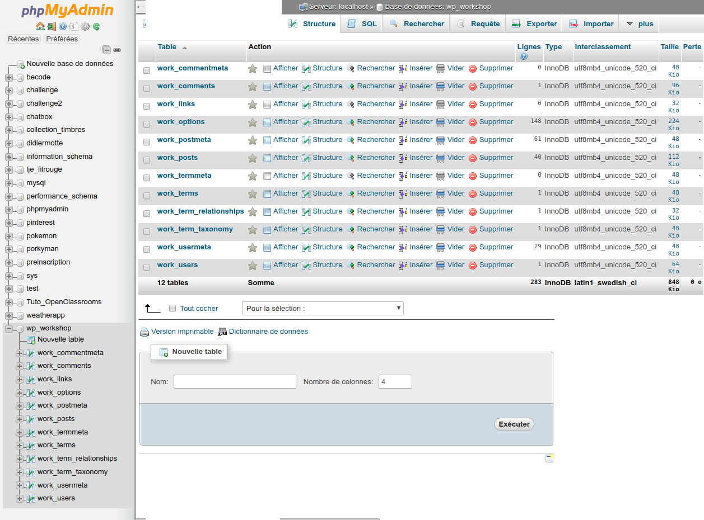

3. Aller dans l'onglet "Exporter"

4. Selectionner le format SQL et "exécuter"

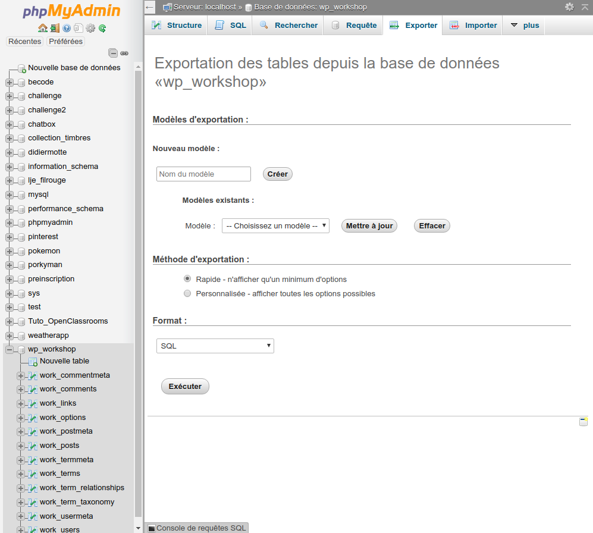

5. Un fichier portant le nom de votre DB avec l'extension .sql est télécharger.

6. Créer à l'endroit de votre sauvegarde un dossier appellé "DB" et placer y le dossier .sql que vous venez de télécharger. Ainsi la sauvegarde de votre DB sera liée à celle de votre site.

Si vous devez restaurer votre site à partir d'une sauvegarde manuelle, vous devrez tout d'abord créer une DB vide portant le nom de la DB de votre site, puis ensuite importer le contenu de la db que vous avez sauvegarder avec phpmyadmin à l'intérieur de celle-ci.

**Attention il est important de faire la sauvegarder de votre site et l'exportation de votre DB au même moment (avant que de nouvelles modifications n'interviennent sur votre site), afin que la sauvegarde de Wordpress corresponde à l'état de la DB au moment de sa sauvegarde.**

### Sauvegarde grâce à un plugin dédié (updraftplus)

Il existe heureusement un plugin très bien conçu qui va vous facilité la vie. Il s'agit du plugin UpdraftPlus (https://fr.wordpress.org/plugins/updraftplus/).

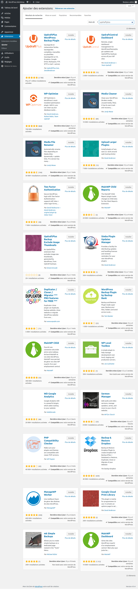

Activer l'application.

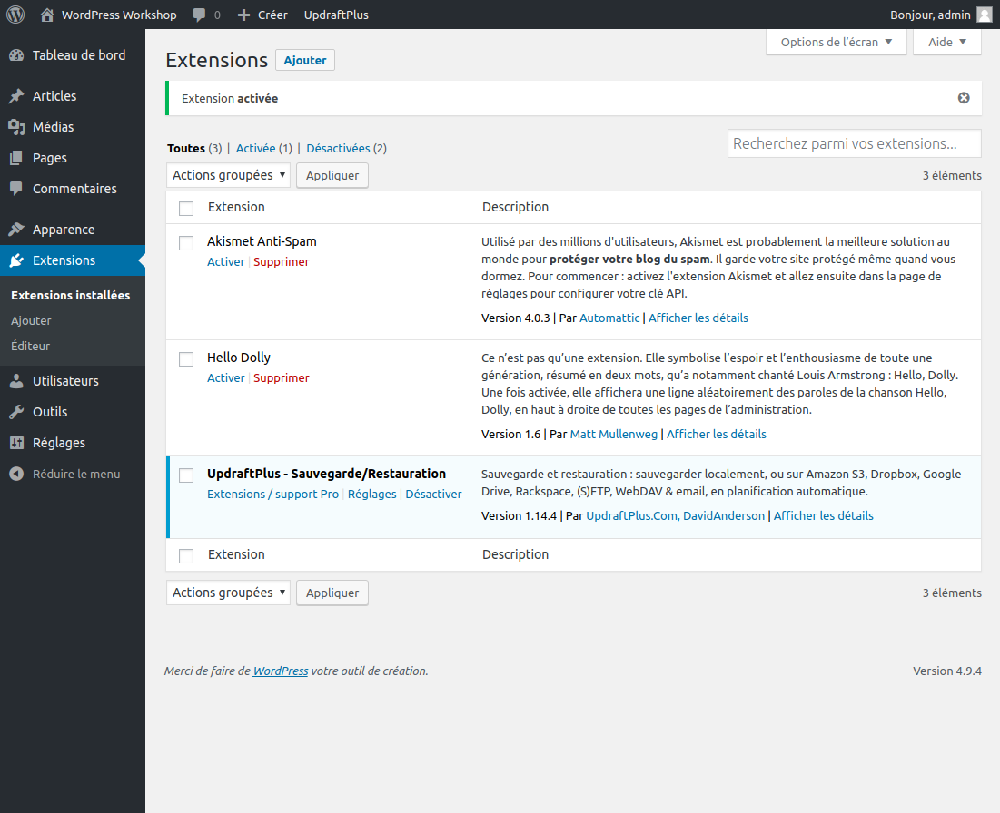

Aller dans "Extensions installées" puis dans UpdraftPlus - Sauvegarde/Restauration "réglages" pour paramètrer les options de sauvegarde et de restauration de votre sites.

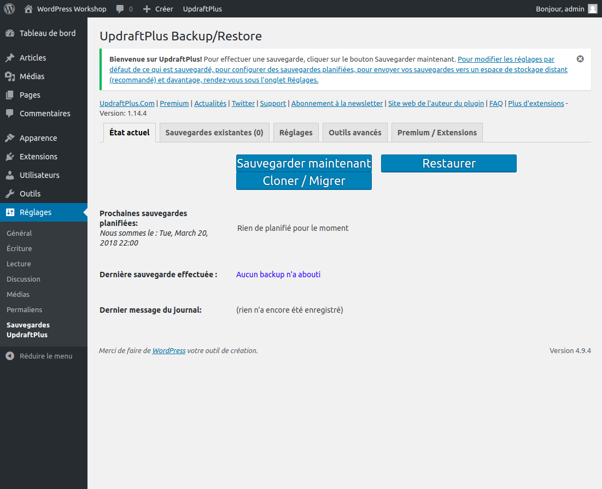

Sauvegarde du site et de la base de données en une seule opérations

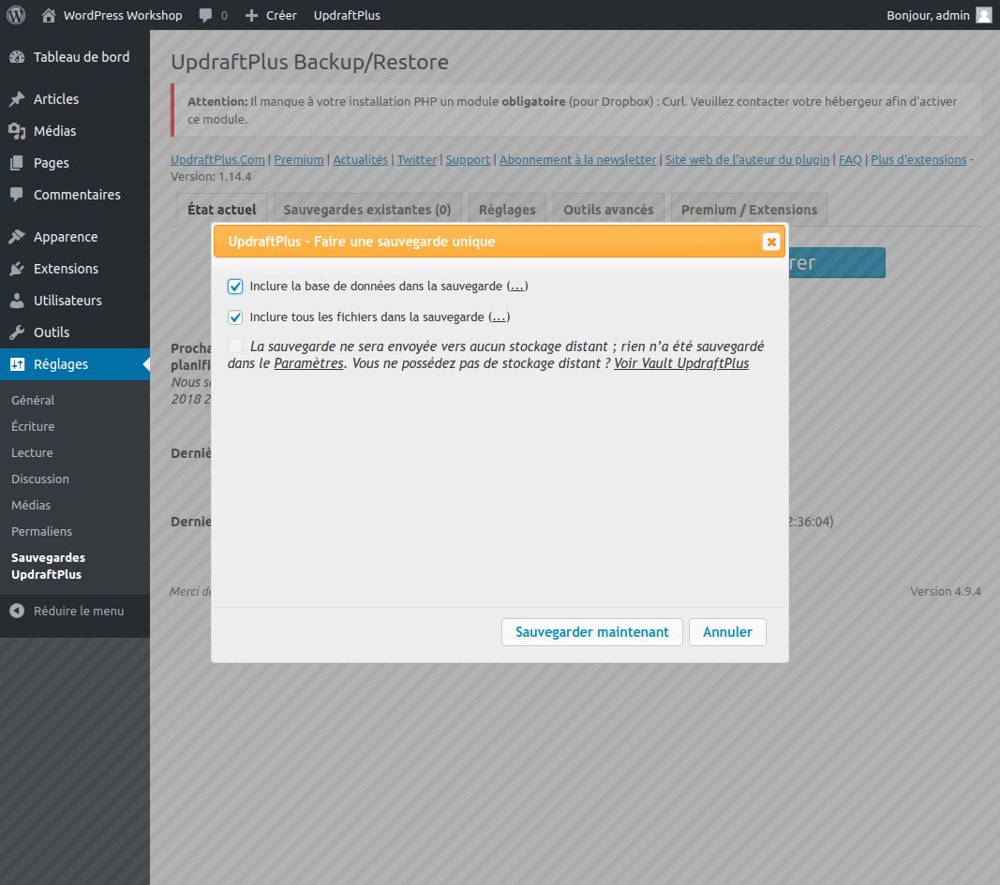

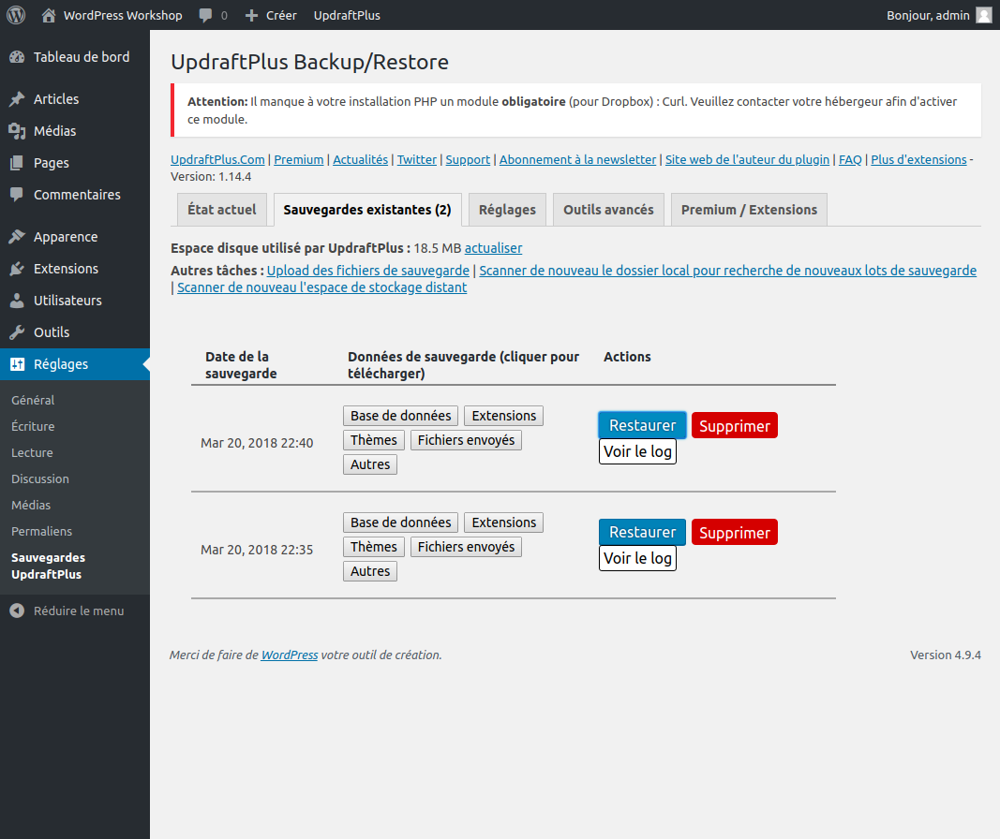

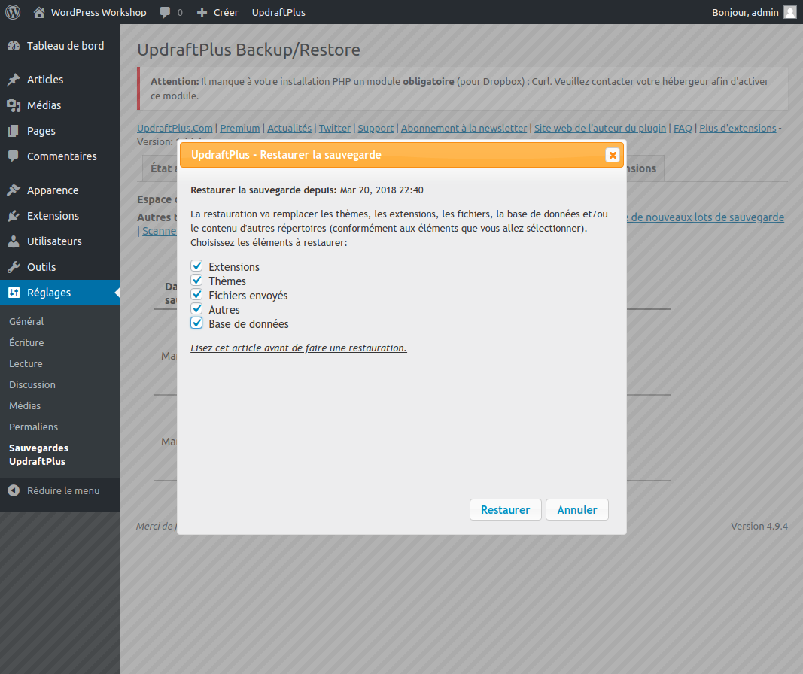

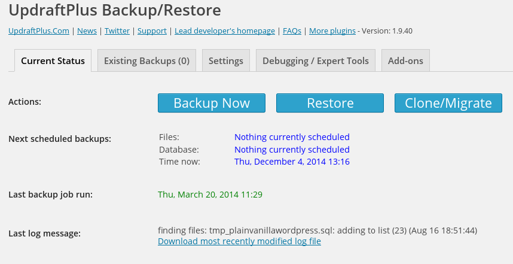

Ce plugin gratuit vous permet non seulement de télécharger en une seule opération tout votre site mais également votre DB et de programmer cette sauvegarde de manière automatique (par exemple tous les jours à 22h00.

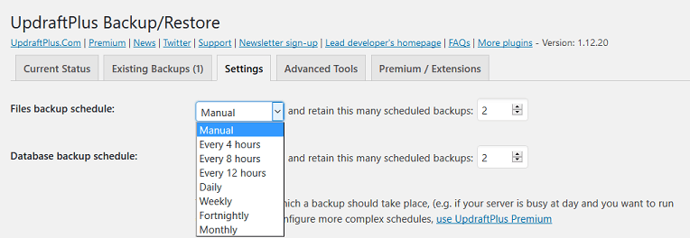

Il vous permet égalemenent de créer une sauvegarde supplémentaire sur un espace distant comme par exemple un espace dropbox.

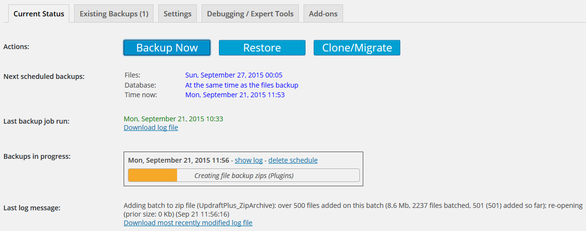

Il permet tout aussi simplement de restaurer votre site mais aussi d'effecturer une migration de celui-ci (sur un autre serveur par exemple).

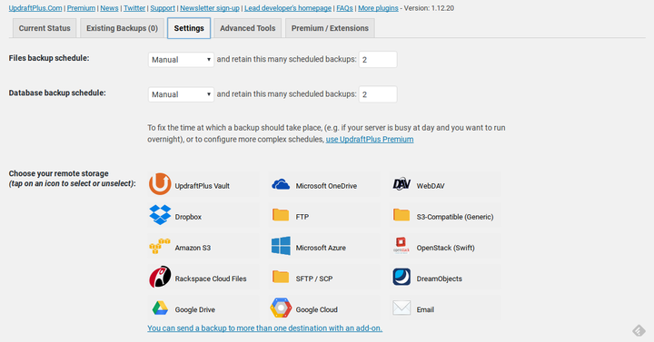

Très simple de prise en main, c'est le plugin de sauvegarde que je vous conseille.

## SEO

Dans settings / permalinks choisir l'option post name pour l'affichage des url qui reprend le titre de l'article . C'est ce qui donne les meilleurs résultats pour le référencement.

Lors de la rédaction de vos articles, veillez à bien choisir les titres mais également à utiliser des mots clefs vous assurant un bon référencement dans le domaine dont traite votre site. Utliser les catégorie (obligatoire), mais utiliser également les étiquettes avec des mots clefs optimisés SEO.

Modifier les permaliens (url) de vos articles afin d'avoir des url propre et dépourvues de mots liens inutiles. Une bonne gestion des permaliens (URL) de vos articles permet une optimisation de l'indexation des pages de votre site et un meilleur référencement. Choisissez l'option "Structure personnalisée dans "Réglages" --> "Permaliens", car c'est cette option qui offre les meilleurs résultats en matière de référencement. (vous pouvez customiser les différentes parties qui compose l'url en choississant de ne pas inclure la date, l'heure, l'auteur, la categorie ou autres...)
